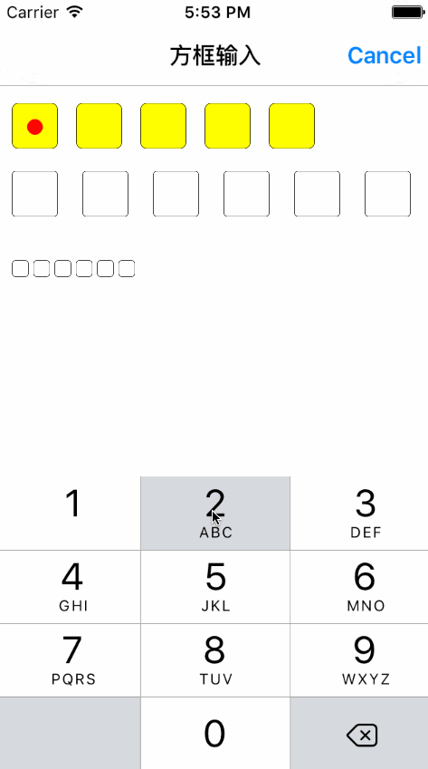

# SYBoxTextField
小方块输入框（类似于微信支付密码的方块输入框）

# 效果图

# 使用方法介绍

~~~ javascript

// 导入头文件
#import "SYBoxTextField.h"

~~~ 

~~~ javascript

// 实例化方法
SYBoxTextField *boxTextfield1 = [[SYBoxTextField alloc] initWithFrame:CGRectMake(10.0, 10.0, 40.0 * 5 + 10 * 5, 40.0)];
[self.view addSubview:boxTextfield1];
boxTextfield1.backgroundColor = [UIColor colorWithWhite:0.0 alpha:0.3];
[boxTextfield1 boxInput:5 textEntry:YES editDone:^(NSString *text) {
    NSLog(@"text %@", text);
}];
boxTextfield1.limitStr = @"0123456789ABCDEFGHIJKLMNOPQRSTUVWXYZabcdefghijklmnopqrstuvwxyz";
boxTextfield1.keyboardType = UIKeyboardTypeNumberPad;
boxTextfield1.textBackgroundColor = [UIColor yellowColor];
boxTextfield1.textCornerRadius = 5.0;
boxTextfield1.textBorderColor = [UIColor blackColor];
boxTextfield1.color = [UIColor redColor];

~~~ 

~~~ javascript

// 实例化方法
SYBoxTextField *boxTextfield2 = [[SYBoxTextField alloc] initWithFrame:CGRectMake(10.0, 60.0, 40.0 * 6 + 15.0 * 6, 40.0) count:6 textEntry:NO editDone:^(NSString *text) {
    NSLog(@"text %@", text);
}];
[self.view addSubview:boxTextfield2];
boxTextfield2.limitStr = @"0123456789";
boxTextfield2.keyboardType = UIKeyboardTypeDefault;

~~~

~~~ javascript

// 实例化方法
SYBoxTextField *boxTextfield3 = [[SYBoxTextField alloc] init];
boxTextfield3.frame = CGRectMake(10.0, 120.0, 100.0, 30.0);
[boxTextfield3 boxInput:6 textEntry:NO editDone:^(NSString *text) {
    NSLog(@"text %@", text);
}];
[self.view addSubview:boxTextfield3];
boxTextfield3.keyboardType = UIKeyboardTypeDefault;

~~~ 

## 修改说明
* 20171017
  * 版本号：1.0.1
  * 完善文档说明
  * 源码与示例分离

  

